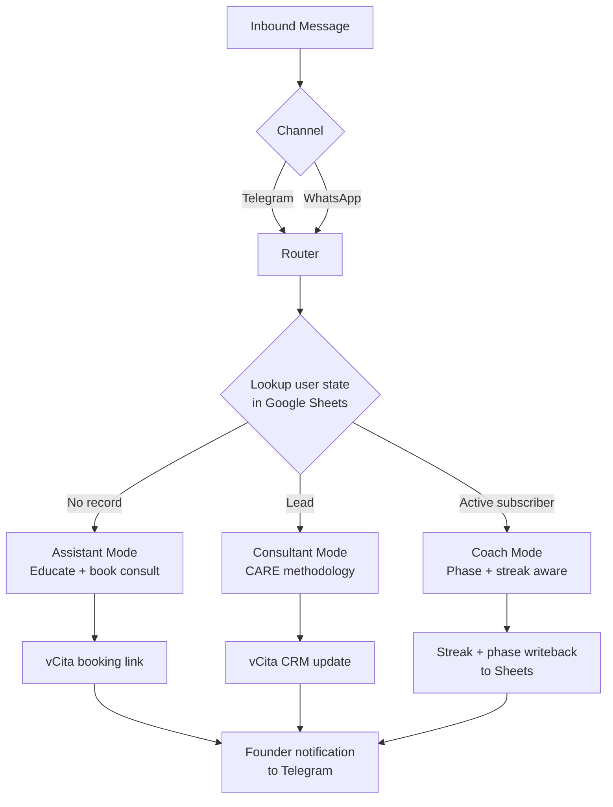

# Multi-Mode Conversational Agent: Telegram + WhatsApp, Three Modes, One Operator

I run a remote wellness clinic and got tired of having the same three conversations over and over. New prospects asking intro questions. Qualified leads who needed a structured walkthrough before they'd subscribe. Active clients needing daily check-ins. So I built a bot that handles all three.

One n8n workflow. Two channels (Telegram and WhatsApp). Three modes routed by user state in Google Sheets. Operational and dogfooded daily — not yet open to large user volume, which is intentional, I'm hardening it before I scale it up.

## Architecture

The router checks Google Sheets for the user's record:

- No record → **Assistant mode** (educate, answer intro questions, book a consult through vCita)
- Lead status → **Consultant mode** (CARE methodology: Connect, Assess, Recommend, Execute — walk them through tier comparison and close)
- Active subscriber → **Coach mode** (phase-aware coaching tied to the four phases of my 112-day program, streak tracking, missed-check-in nudges)

The AI Agent node's system prompt is composed at runtime: base persona + mode-specific block + the user's current state pulled from Sheets.

## Why one workflow instead of three

I considered three separate workflows but rejected it. Users move between modes — prospect becomes a lead, lead becomes a subscriber — and I needed continuity across that journey. Three workflows means three state stores and a sync problem. One workflow with state-driven routing keeps the history clean and the handoffs invisible to the user.

## Why Google Sheets for state

It's a prototype. Sheets gave me visibility — I could see every user's state at a glance while building, and non-technical staff could spot-check it without me writing a UI. Known ceiling: write contention at high concurrency. If I scale past ~1000 active users I'll move to Postgres. Flagging it because that's the honest read.

## Why hardcoded sales methodology

Left to "sell naturally," LLMs either pitch too early or never close. Hardcoding the CARE flow as a four-step structure in the prompt gave the Consultant mode reliable behavior. The structure is in the prompt, the model fills in the words.

## Bugs I hit and how I fixed them

**The n8n `promptType` reset.** Updating the AI Agent node's `systemMessage` via API caused the bot to silently regress — generic responses across all three modes. When n8n receives a partial update with only `systemMessage`, it resets `promptType` from `"define"` to `"auto"`, which makes the agent ignore my prompt and generate its own. Fix: always send `promptType: "define"` AND the full `text` field together, even when only changing one of them. Wrote a runbook because every prompt update would have silently re-broken it otherwise.

**Timezone-safe streak math.** Streaks were resetting wrong for users in non-Eastern timezones. I'd used `new Date()` and assumed UTC. A user checking in at 11pm local registered as a different calendar day than one at 1am, breaking the streak. Fix: replaced all date comparisons with `Intl.DateTimeFormat.formatToParts()` against the user's stored timezone. Correct now regardless of where they check in from.

**WhatsApp 24-hour window.** Daily reminders were silently failing for some users. Meta's WhatsApp Business API only allows free-form messages within 24 hours of the user's last inbound message — outside that window, only pre-approved templates can be sent. The bot was trying to send free-form replies to users whose window had already closed. Fix: built a template library for routine outreach (reminders, phase transitions, missed-check-in nudges) and reserved free-form responses for active conversations. The router now checks in-session vs out-of-session before composing.

**Meta token outage.** All WhatsApp send nodes failed at once and I didn't catch it for hours. Standard Meta access tokens expire. Fix: migrated to a permanent System User token (`Collins_Wellness_Bot`), corrected a Business Account ID mismatch that surfaced during the migration, and added a daily health-check workflow that pings the send endpoint and alerts me on failure.

## What I'd do differently

**Evals from day one.** Most of my debugging was reactive — I caught bugs after they shipped. A small eval suite (30 test conversations per mode, run on every prompt change) would have caught at least two of these before production. Single biggest gap in my workflow and the first thing I'd build differently.

**Separate the LLM layer from orchestration.** Right now they're coupled inside n8n's AI Agent node, which is part of why the `promptType` bug was so painful — I couldn't mock the LLM call independently. If I were rebuilding in code, orchestration goes in LangGraph and the LLM call is a clean boundary I can mock and test against.

**Real database earlier.** Sheets was right for prototyping but I'll outgrow it. Postgres would also let me run analytics queries directly instead of exporting CSVs.

## Stack

- **Orchestration:** n8n (self-hosted)
- **LLM:** Anthropic Claude via n8n's AI Agent node
- **State:** Google Sheets (canonical user state, streak, phase, last-check-in timestamp)
- **CRM:** vCita
- **Channels:** Telegram Bot API, WhatsApp Business API (Meta Graph API, permanent System User token)
- **Notifications:** Telegram (operator alerts), Gmail, Google Calendar
- **Booking:** vCita online scheduling

---

*Source code is private — it operates against a real clinic — but the architecture and the engineering decisions are all here. Happy to walk through any part of this in detail.*
