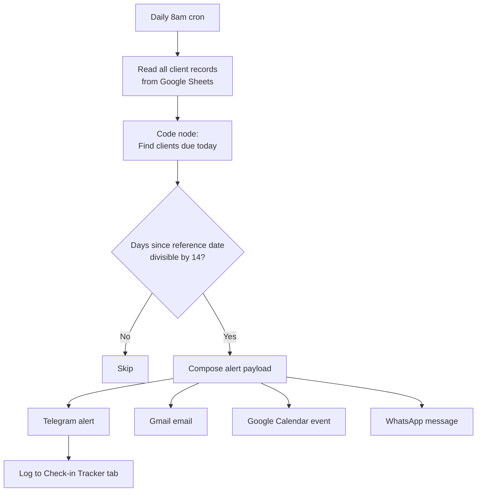

# Multi-Channel Check-In Alert System: Human-in-the-Loop with Anniversary-Based Triggers

I run a remote wellness clinic. Active clients move through a 112-day program (the Coherence Protocol) plus standard subscription tiers, and I needed a way to make sure I was personally checking in with every active client at the right cadence — without relying on memory to track when each one was due. So I built a workflow that runs daily, identifies who's hit a check-in interval that day, and fans out an alert across four channels (Telegram, Gmail, Google Calendar, WhatsApp) so I can't miss it.

It's a smaller system than the conversational bot but it's the one I rely on most. The whole point was to take "remembering when each client needs attention" off my plate.

This is intentionally **human-in-the-loop**: the system surfaces who needs attention, I do the actual outreach. I considered fully autonomous client outreach but for clinical clients — especially those in active protocols — I want a human (me) deciding the right message and timing. The system is the calendar; I'm the call.

## Architecture

The workflow runs daily at 8am. It pulls every client from Google Sheets, runs each one through the trigger logic in a Code node, and for anyone who's due today fans out the alert payload across four channels and logs it to a `Check-in Tracker` tab.

## How the trigger logic actually works

This took a few iterations to get right. The naive version — "alert me 14 days after the client signed up" — falls apart because clients in the Coherence Protocol move through four phases (Decoherence, Entanglement, Superposition, Coherence) and the meaningful clock isn't enrollment date, it's their current phase start date.

So the code branches on program type:

- **Coherence Protocol clients** → reference date is `phase_start_date`. When they advance phases, the clock resets.
- **Standard subscription clients** → reference date is `created_date`. Single clock from enrollment.

Then for either group, I alert when `days_since_reference % 14 === 0` — anniversary-based, not "days since last contact." So a client who started their phase 56 days ago has already triggered at 14, 28, and 42 days, and triggers again today at 56.

There's also an **escalation**. For Coherence clients past day 28 in any phase but the last, the alert changes from a routine check-in to a `PHASE REVIEW` prompt — these are clients potentially ready to advance, and that's a clinical decision I want to make consciously rather than miss. The phase names are mapped in code (`{1: 'Decoherence', 2: 'Entanglement', 3: 'Superposition', 4: 'Coherence'}`) so the alert tells me exactly where they are.

## Timezone-safe day math

Same kind of bug that bit me on streak calculations in the conversational bot, different solution.

The streak math (in [case study #1](./01-unified-conversational-agent.md)) used `Intl.DateTimeFormat.formatToParts()` against the user's stored timezone. That works well when each user has a tz attached and you're comparing "their local day" to "their local day."

For this workflow I needed something different. The comparison is "today (server) vs reference date (stored)" — DST shifts and millisecond drift could push a comparison across a day boundary and cause an alert to fire on day 13 or day 15 instead of exactly day 14.

The fix: anchor every date comparison to noon (`T12:00:00`) of the relevant day. DST shifts are at most an hour, so noon is far enough from any day boundary that the comparison can't cross over. Cleaner than full timezone tracking for a workflow already running in a single server timezone.

## Why fan out across four channels

Different channels catch me in different contexts: Telegram on phone, Gmail at desk, Calendar when I'm planning my day, WhatsApp as redundancy. The cost is near zero (n8n calls them in parallel) and I haven't missed a client since I deployed it.

The `Check-in Tracker` audit log gives me queryable history — I can sort by client, see how many alerts fired, spot pattern-skippers, see whether my follow-throughs match my alerts.

## Why hardcode 14 days

Operator judgment from running the practice. Weekly contact kept clients engaged but burned my time; monthly let them drift. Two weeks landed in the cadence that matched how clients actually behave with the protocol — long enough that the touchpoint feels intentional, short enough that nobody disappears between contacts. The next iteration makes this configurable per client (some want weekly, some monthly) but the default stays 14.

## Why log to Sheets rather than a real database

Same reasoning as the conversational bot — Sheets gives me visibility I'd lose with Postgres at this scale. I can scan the audit log by eye to spot patterns. The `Check-in Tracker` append uses `continueOnFail: true` so a Sheets hiccup doesn't kill the alert fan-out — defensive choice that's saved me at least once when I accidentally renamed the tab.

## Failure modes I'm watching for

The system has been clean since launch but several things are on my watchlist — and the process of writing this case study surfaced one I need to fix:

**The WhatsApp leg isn't actually working.** Currently configured to send free-form text *to me* (operator-style notification, like Telegram and Gmail). But Meta's WhatsApp Business API only allows free-form messages within 24 hours of the user's last inbound message — outside that window, only pre-approved templates can be sent. Since this workflow fires daily without a session, my own WhatsApp wasn't receiving the alerts most days. The fix in progress: pivot the WhatsApp leg from operator notification to client-facing — send the client an approved UTILITY template directly. WhatsApp's actual role in my stack is client-facing communication anyway, so this converts a broken redundancy channel into a real new capability: clients get a gentle 14-day touch from the system in addition to my three operator alerts. Found this gap by writing this document, which is exactly what writing case studies is for.

**Duplicate fires.** All four channel calls trigger from the same node, so no in-day race condition. If I add retry logic later, an idempotency key (`hash(client_id + alert_date)`) prevents re-fires.

**Silent channel failure.** If Gmail breaks but Telegram fires, I might never notice — the alert "worked" from my perspective. The log captures the attempt but not the delivery. Per-channel delivery confirmation is on the list.

**Phase-review false negatives.** The escalation only fires for clients in phases 1-3. If a client gets stuck in phase 4 longer than expected, no escalation fires. Probably fine — phase 4 is integration and longer is healthy — but worth monitoring.

## What I'd do differently

**Configurable threshold per client.** Hardcoded 14-day global works for now. Pulling a `check_in_interval_days` column from each client's row would make it cheap to tune per client.

**Acknowledgment endpoint.** If I check in with a client through an out-of-band channel (real conversation, phone call), the system doesn't know — it'll fire on the next interval anyway. A simple "mark as contacted" callback from the alert would close that loop.

**Per-channel delivery confirmation.** Tied to the silent-failure watchlist item. Log delivery status, alert myself when a channel has been failing.

**Move WhatsApp from operator notification to client touchpoint.** In progress, described above.

## Stack

- **Orchestration:** n8n (self-hosted), Schedule Trigger (cron `0 8 * * *`)
- **Trigger logic:** Code node (JavaScript), branching on program type, anniversary-based intervals, phase-review escalation
- **State:** Google Sheets (canonical client list with `program`, `coherence_phase`, `phase_start_date`, `created_date`, `subscription_tier`, `whatsapp_number`, `telegram_id`)
- **Channels:** Telegram Bot API, Gmail, Google Calendar API, WhatsApp Business API (in transition — see Failure Modes)
- **Audit log:** Google Sheets `Check-in Tracker` tab, with `continueOnFail: true` so logging hiccups don't break the fan-out
- **Workflow ID:** `YiouVPVjHjv2HgXj`

---

*Companion to the [Multi-Mode Conversational Agent](./01-unified-conversational-agent.md). The two systems share the same Sheets state layer — the conversational bot reads and writes user state on every interaction, this workflow reads it daily for due-date detection.*
